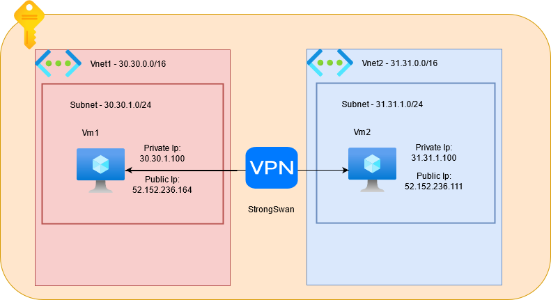
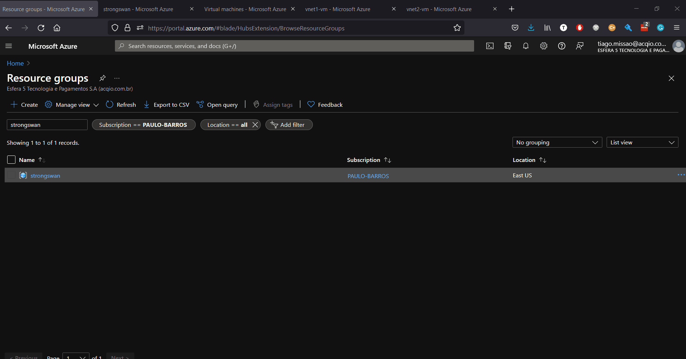

# StrongSwan Poc

This project intends to build an IpSec VPN using StrongSwan. In order to do that, two Virtual Machines are created in two distinct subnets and a VPN is setup to allow communication between them.

## Setup
---

- [Create an Azure Account](https://azure.microsoft.com/en-us/free/)
- [Install TF_ENV](https://github.com/tfutils/tfenv)
- Public SSH Key located on `~/.ssh/id_rsa.pub`
- [Install Ansible](https://docs.ansible.com/ansible/latest/installation_guide/intro_installation.html)

## How it Works ?
---

The current terraform code builds the following architecture:



So, two Vnets completely isolated are created, and each vnet contains a subnet and a virtual machine with a public ip. Using StrongSwan a VPN is built allowing the the VMs reach each other.

## Usage
---

On this project it is possible to setup the VPN using just `terraform` or using `terraform + ansible`

### `Terraform`

Setup the variable `strongswan_ansible_setup` to `false` on [vars.tf](./src/terraform/vars.tf) file and run the following commands:

```bash
cd src/terraform
tfenv install
tfenv use
terraform init
terraform apply
```

### `Terraform + Ansible`

Setup the variable `strongswan_ansible_setup` to `true` on [vars.tf](./src/terraform/vars.tf) file and run the following commands:

```bash
cd src/terraform
tfenv install
tfenv use
terraform init
terraform apply
```

## Results
---


## References
---

 - [Tunneling between AWS & Azure](https://faun.pub/tunneling-aws-to-azure-e23d0defb971)